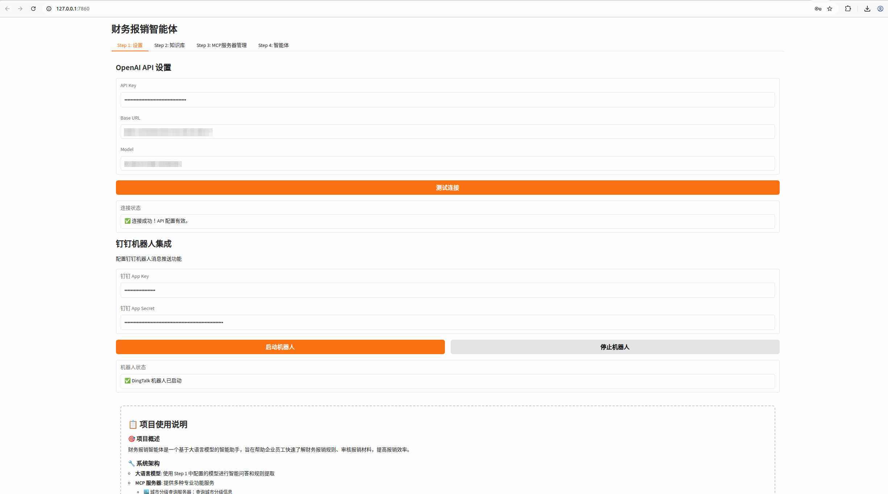

---

domain: multi-modal
tags:
- 单据审核
- 智能审核
- 发票识别
- 大语言模型
- MCP
datasets:
  evaluation:
  test:
  train:
models:
license: Apache License 2.0
---

#### Clone with HTTP
```bash
 git clone https://github.com/megemini/AuditAgent.git
```

**🌐 Language / 语言**: [English](README_EN.md) | [中文](README.md)

# 单据审核智能体 (AuditAgent)



AI Studio 项目应用地址：
https://aistudio.baidu.com/application/detail/103657

AI Studio 项目演示地址：
https://www.bilibili.com/video/BV1ybUWBhEvh/?vd_source=52a02e4f0aa6b27776bd86a6d103f2d1

## 📋 项目概述

单据审核智能体是一个基于大语言模型的智能助手，旨在帮助企业员工快速了解单据审核规则、审核单据材料，提高审核效率。该系统集成了多种先进技术，包括自然语言处理、光学字符识别(OCR)、模型上下文协议(MCP)等，为用户提供全方位的单据审核服务。

### 🎯 核心功能

1. **智能规则提取**：从多种文档格式（PDF、Word、TXT）中自动提取单据审核规则
2. **发票智能识别**：使用先进的OCR技术和大语言模型识别发票信息
3. **智能审核流程**：基于提取的规则对发票进行逐条验证和审核
4. **多工具协作**：集成多个MCP服务器，提供城市分级查询、日期时间计算等专业功能
5. **流式交互**：支持实时流式输出，提供流畅的用户体验

## 🏗️ 系统架构

### 整体架构

```
┌─────────────────────────────────────────────────────────────┐
│                    单据审核智能体                          │
├─────────────────────────────────────────────────────────────┤
│  ┌─────────────┐  ┌─────────────┐  ┌─────────────┐         │
│  │   设置      │  │  知识库     │  │ MCP服务器    │         │
│  │  (Step 1)   │  │  (Step 2)   │  │  (Step 3)   │         │
│  └─────────────┘  └─────────────┘  └─────────────┘         │
│                                                             │
│  ┌─────────────────────────────────────────────────────┐   │
│  │                  智能问答                           │   │
│  │                 (Step 4)                            │   │
│  └─────────────────────────────────────────────────────┘   │
└─────────────────────────────────────────────────────────────┘
                              │
                              ▼
┌─────────────────────────────────────────────────────────────┐
│                    MCP服务器层                             │
├─────────────────────────────────────────────────────────────┤
│  ┌─────────────┐  ┌─────────────┐  ┌─────────────┐         │
│  │城市分级服务器│  │发票识别服务器│  │日期时间服务器│         │
│  └─────────────┘  └─────────────┘  └─────────────┘         │
└─────────────────────────────────────────────────────────────┘
                              │
                              ▼
┌─────────────────────────────────────────────────────────────┐
│                    大语言模型层                             │
├─────────────────────────────────────────────────────────────┤
│                OpenAI API / 本地LLM                       │
└─────────────────────────────────────────────────────────────┘
```

### 技术栈

- **前端界面**: Gradio - 提供直观的Web用户界面
- **大语言模型**: 支持OpenAI API兼容的模型（如Qwen系列）
- **MCP协议**: FastMCP - 实现工具调用和服务器通信
- **OCR技术**: PaddleOCR - 用于发票文本提取
- **文档处理**: PyMuPDF (PDF)、python-docx (Word)
- **异步处理**: asyncio - 支持高效的异步操作
- **文件服务**: 内置HTTP文件服务器

### 核心组件

#### 1. 主应用 (app.py)
- 提供完整的Gradio用户界面
- 实现会话管理和状态保持
- 集成所有MCP服务器客户端
- 处理文件上传和规则提取
- 实现流式智能问答功能

#### 2. MCP服务器层

**城市分级服务器 (mcp_citytier_stdio.py)**
- 基于最新城市分级数据
- 支持单城市查询、批量查询
- 提供分级城市列表功能
- 覆盖一线至五线城市数据

**发票识别服务器 (mcp_invoice_stdio.py)**
- 集成PaddleOCR进行文本提取
- 使用大语言模型进行智能字段解析
- 支持多种发票格式和类型
- 提供高精度的发票信息识别

**日期时间服务器 (mcp_datetime_stdio.py)**
- 提供全面的日期时间功能
- 支持多时区查询
- 实现日期计算和格式化
- 支持日期差值计算

#### 3. 发票处理核心 (invoice_core_llm.py)
- 实现基于大语言模型的发票信息提取
- 集成OCR技术和AI分析
- 提供结构化的发票字段输出
- 支持多语言发票处理

## 🚀 核心特性

### 1. 智能规则提取
- **多格式支持**: 支持TXT、PDF、DOCX、DOC等多种文档格式
- **自动解析**: 使用大语言模型自动识别和提取审核规则
- **结构化输出**: 将规则转换为JSON格式，便于后续处理
- **示例内置**: 提供完整的单据审核规则示例

### 2. 发票智能识别
- **多格式处理**: 支持图片文件(JPG、PNG等)和PDF文档
- **高精度OCR**: 使用PaddleOCR进行准确的文本提取
- **AI驱动分析**: 利用大模型进行智能字段提取和验证
- **隐私保护**: 所有处理都在本地进行，确保数据安全

### 3. 智能审核流程
- **逐条验证**: 系统性地逐条验证每条审核规则
- **多工具协作**: 根据需要调用相应的MCP工具
- **实时反馈**: 每验证完一条规则立即给出结果
- **综合报告**: 生成详细的审核报告和改进建议

### 4. 流式交互体验
- **实时输出**: 支持流式输出，提供即时的用户反馈
- **状态指示**: 清晰显示AI思考、工具调用等状态
- **错误处理**: 完善的错误处理和用户提示
- **会话保持**: 支持多轮对话和上下文保持

## 📝 使用指南

### 环境要求

- Python 3.10+
- 操作系统: Windows/Linux/macOS
- 内存: 推荐8GB以上
- 网络连接: 需要访问大语言模型API

### 安装步骤

1. **克隆项目**
```bash
git clone https://github.com/megemini/AuditAgent.git
cd AuditAgent
```

2. **创建虚拟环境**
```bash
python -m venv venv
source venv/bin/activate  # Linux/macOS
# 或
venv\Scripts\activate  # Windows
```

3. **安装依赖**
```bash
pip install -r requirements.txt
```

### 使用流程

#### Step 1: 设置
1. 配置OpenAI API密钥
2. 设置API基础URL
3. 选择使用的模型
4. 测试连接确保配置正确

#### Step 2: 知识库
1. 上传单据审核规则文档（支持TXT、PDF、DOCX格式）
2. 或使用内置的示例文档
3. 系统自动提取规则并转换为JSON格式
4. 查看提取的规则确认准确性

#### Step 3: MCP服务器管理
1. 连接城市分级查询服务器
2. 连接发票识别LLM服务器
3. 连接日期时间服务器
4. 确认所有服务器连接状态正常

#### Step 4: 智能问答
1. 输入单据审核相关问题
2. 可选择上传发票图片或PDF文件
3. 系统基于规则进行智能分析和审核
4. 获得详细的审核报告和建议

### 使用示例

#### 示例1: 查询审核标准
```
用户: 差旅费的住宿标准是什么？

系统: 根据单据审核规则，差旅费的住宿标准按城市分级有所不同：
- 一线城市：600元/晚
- 二线城市：500元/晚
- 其余地区统一400元/晚
```

#### 示例2: 发票审核
```
用户: [上传北京某酒店的发票图片]
用户: 审核一下此张单据

系统: 我将对这张发票进行详细审核...

第一步：发票识别
→ 使用recognize_single_invoice工具识别发票信息
→ 提取信息：金额580元，日期2025-08-20，城市北京

第二步：逐条规则验证
正在验证规则1：差旅费住宿标准
→ 需要查询城市分级 → 调用query_city_tier工具
→ 验证结果：✅ 符合
→ 详细说明：北京属于一线城市，住宿标准为600元/晚，发票金额580元未超出标准

第三步：汇总审核结果
📋 发票审核报告
📊 规则验证结果：
- ✅ 符合规则1：差旅费住宿标准
📈 审核统计：
- 总规则数：1
- 符合规则：1
- 不符合规则：0
🎯 最终结论：发票审核通过
```

## 🔧 高级特性

### 1. MCP工具调用系统

系统集成了多个MCP服务器，提供丰富的工具调用能力：

**城市分级工具**
- `query_city_tier`: 查询单个城市分级
- `query_multiple_cities`: 批量查询多个城市分级
- `get_tier_cities`: 获取指定分级的城市列表

**发票识别工具**
- `recognize_single_invoice`: 识别单张发票
- `recognize_multiple_invoices`: 批量识别多张发票
- `get_invoice_template_info`: 获取支持的发票模板信息

**日期时间工具**
- `get_current_date`: 获取当前日期
- `get_current_time`: 获取当前时间
- `get_current_datetime`: 获取当前日期时间
- `get_datetime_by_timezone`: 获取指定时区的日期时间
- `calculate_date_difference`: 计算日期差值
- `add_days_to_date`: 日期加减天数

### 2. 流式输出机制

系统实现了先进的流式输出机制，提供以下特性：

- **实时状态显示**: 显示AI思考、工具调用等状态
- **逐步结果呈现**: 逐条显示规则验证结果
- **错误处理**: 完善的错误提示和恢复机制
- **会话管理**: 支持多轮对话和上下文保持

### 3. 文件处理系统

- **多格式支持**: 支持TXT、PDF、DOCX、DOC、JPG、PNG等格式
- **自动清理**: 定期清理非当天的上传文件
- **安全访问**: 内置文件服务器，确保文件访问安全
- **临时文件**: 智能的临时文件管理

### 4. 会话管理系统

- **会话隔离**: 每个用户会话独立，数据不互相干扰
- **状态保持**: 保持API配置、提取规则等会话状态
- **安全存储**: 敏感信息如API密钥安全存储
- **自动清理**: 智能的会话生命周期管理

## 🔒 安全与隐私

### 数据安全
- **本地处理**: 所有文件处理都在本地进行
- **临时文件**: 上传文件定期自动清理
- **访问控制**: 内置文件服务器提供安全的文件访问
- **会话隔离**: 用户数据严格隔离

### API安全
- **密钥管理**: API密钥安全存储，不暴露给前端
- **会话绑定**: API配置与会话绑定，防止跨会话访问
- **传输加密**: 所有API调用使用HTTPS加密传输

### 隐私保护
- **无数据留存**: 处理完成后不保留用户数据
- **匿名处理**: 不收集用户个人信息
- **本地部署选项**: 支持完全本地化部署

## 🌟 优势与价值

### 技术优势
1. **先进架构**: 基于MCP协议的模块化架构，易于扩展
2. **多模态处理**: 支持文本、图像、PDF等多种格式
3. **智能集成**: 无缝集成大语言模型和专业工具
4. **流式交互**: 提供流畅的实时用户体验

### 业务价值
1. **提高效率**: 自动化单据审核，大幅提升处理速度
2. **降低成本**: 减少人工审核成本，降低错误率
3. **标准化**: 确保单据审核的一致性和标准化
4. **合规性**: 基于规则进行审核，确保合规要求

### 用户体验
1. **简单易用**: 直观的四步操作流程
2. **实时反馈**: 即时的审核结果和状态显示
3. **智能提示**: 智能的错误提示和操作指导
4. **多轮对话**: 支持连续的问答和交互

## 🏢 本地部署说明

此智能体可以完全在本地进行部署，并连接本地大模型，确保数据安全和隐私保护。为了方便演示和快速体验，当前版本已修改为适配远端服务器配置。

### 本地部署优势
- **数据安全**: 所有数据处理都在本地完成，敏感财务信息不会离开企业网络
- **隐私保护**: 无需将数据传输到外部服务器，完全符合数据保护法规要求
- **离线运行**: 支持完全离线运行，不依赖外部网络连接
- **定制化**: 可根据企业具体需求进行深度定制和优化
- **成本控制**: 长期使用成本更低，无需支付API调用费用

### 本地部署要求
- 本地大语言模型服务（如Ollama、LocalAI等）
- 足够的硬件资源（GPU推荐用于模型推理）
- 本地文件存储和处理能力
- 企业内部网络环境

**演示说明**: 当前演示版本使用远端服务器配置以便于快速体验，在实际生产环境中，建议采用本地部署方案以确保数据安全和合规性。

---

**免责声明**: 本项目提供的单据审核规则和审核功能仅供参考学习使用，不构成任何法律或财务建议。实际单据审核制度应根据公司具体情况、行业特点和当地法律法规进行定制。使用本系统前，请务必咨询专业的财务、法律顾问。