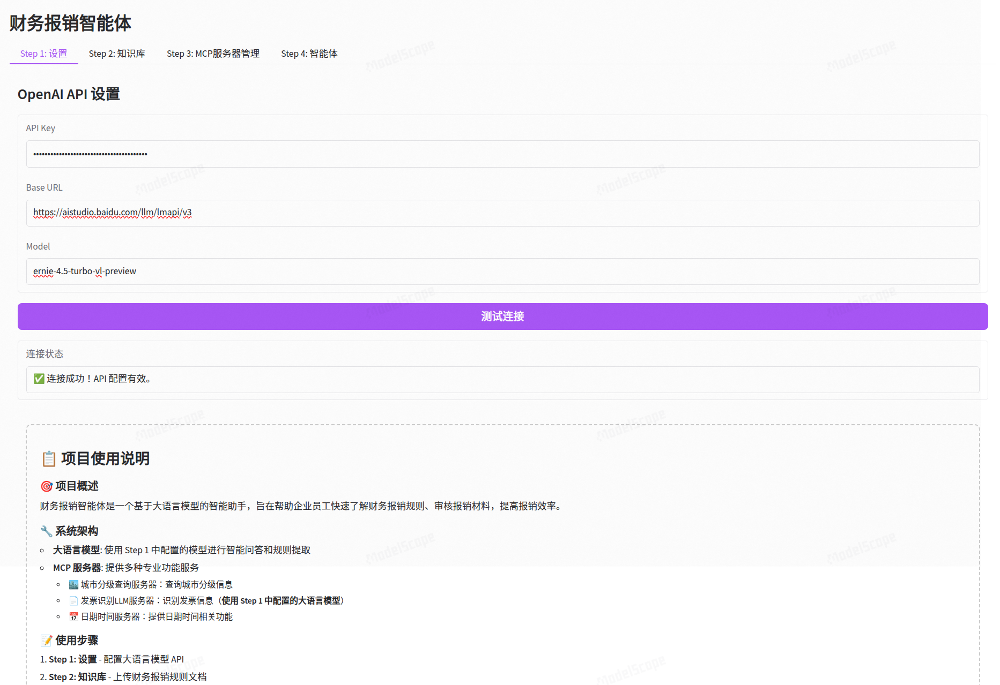
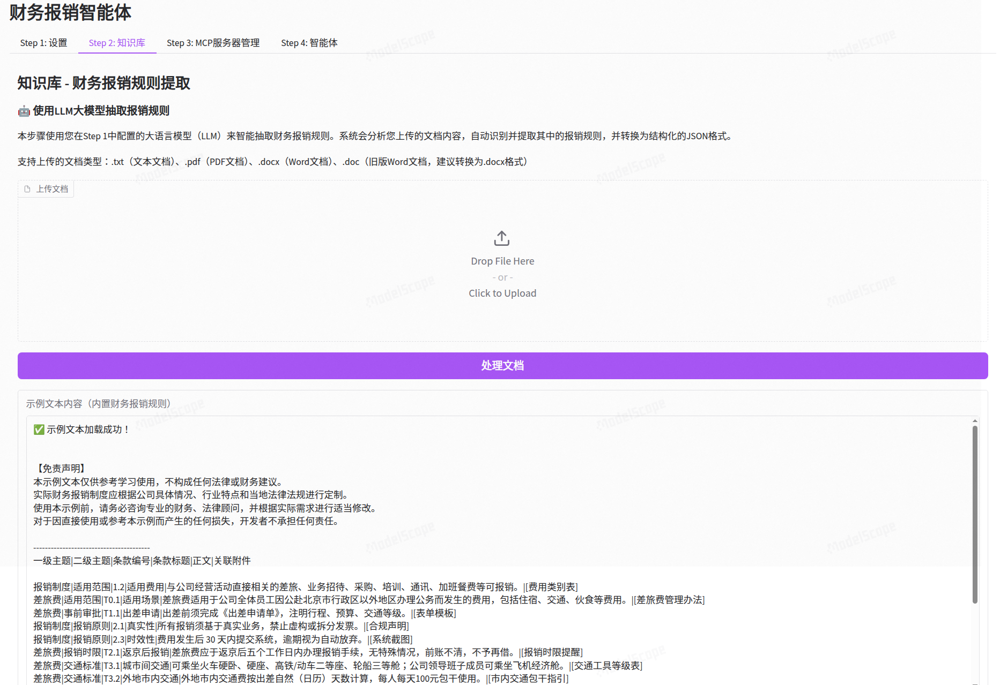
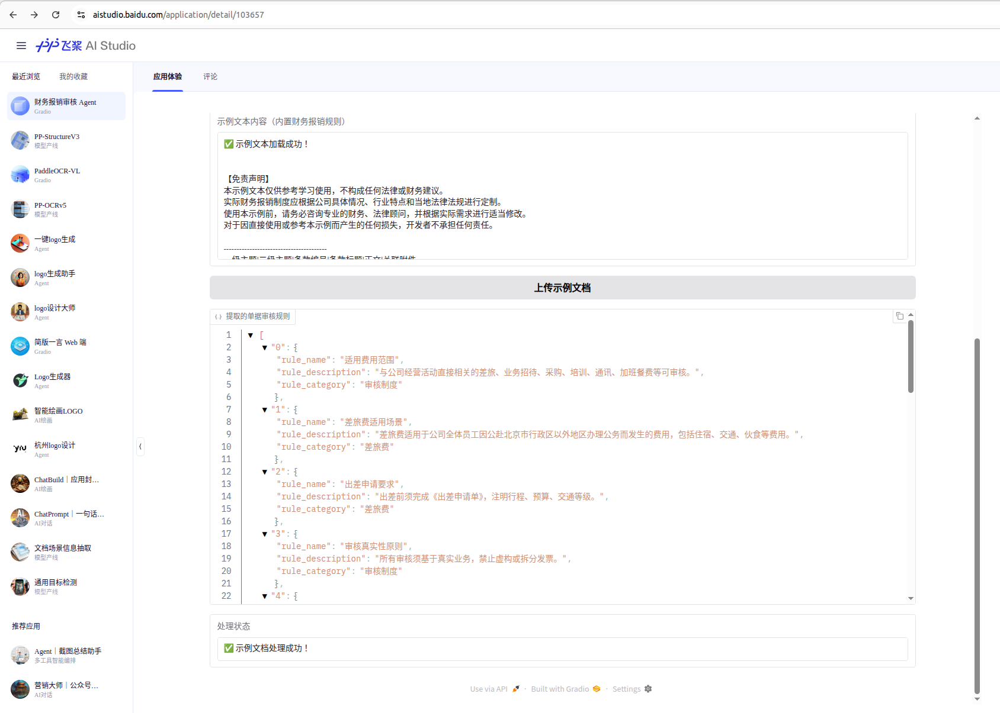
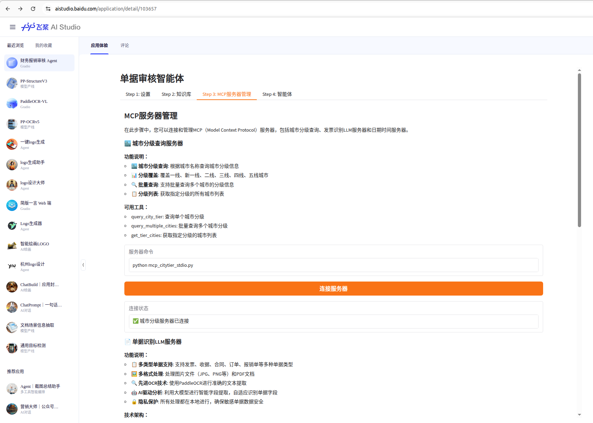
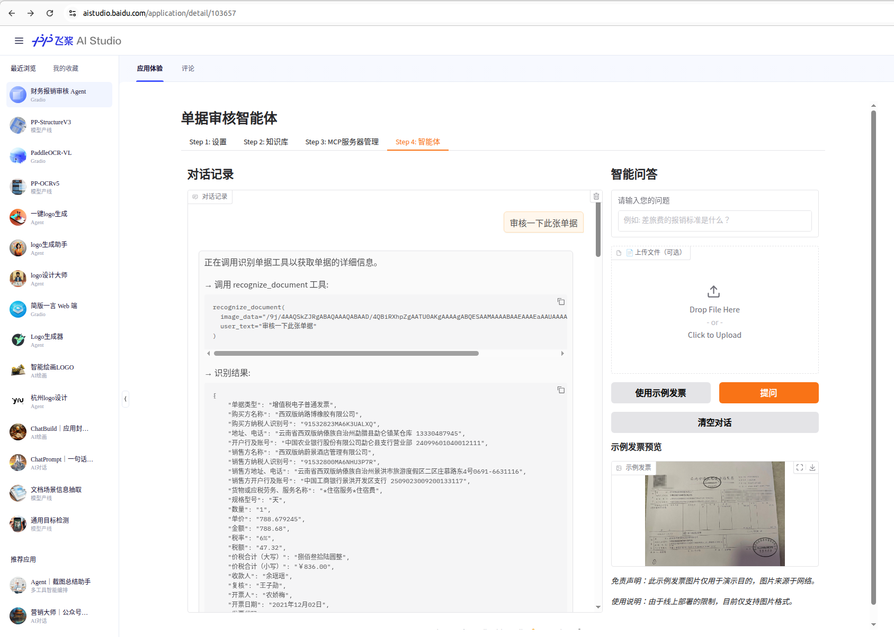
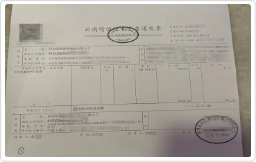
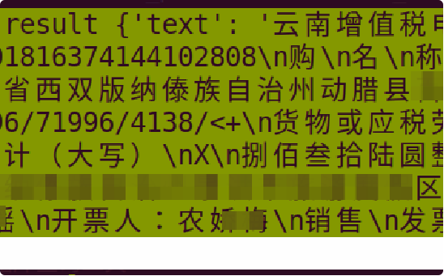
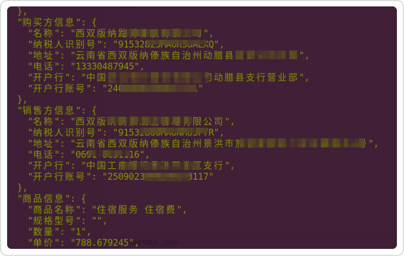
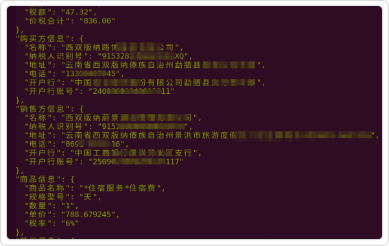
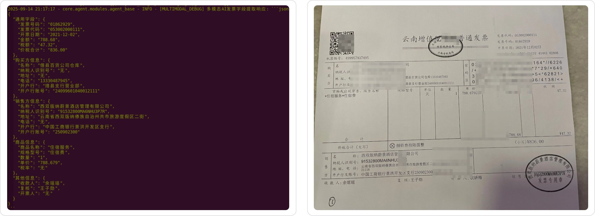

# 财务文档智能审核系统项目方案书

## 1. 项目概述

### 1.1 项目背景
随着企业数字化转型的深入推进，单据审核流程的智能化需求日益迫切。传统财务审核主要依赖人工处理，存在效率低下、标准不统一、易出错等问题。基于多模态大模型的单据审核系统能够充分利用视觉理解、文本识别和语义分析的协同优势，在处理复杂文档格式、精准识别涂改痕迹、深度理解多模态信息等方面展现出卓越能力，显著提升单据审核的准确性和效率。

### 1.2 项目目标
本项目旨在构建一个基于文心大模型4.5多模态系列模型的财务文档智能审核系统，通过整合视觉理解、文本识别和语义分析能力，实现财务文档的自动化识别、结构化提取和智能审核，显著提升财务处理效率和质量。

### 1.3 项目范围
- 多模态财务文档识别与理解
- 结构化信息提取与验证
- 智能规则匹配与审核
- 异常检测与风险预警
- 审核报告生成与分析

## 2. 应用场景价值

### 2.1 目标场景
**核心应用场景：**
1. **财务文档智能审核**：发票、单据等多种财务票据和单据的自动化识别与逐条规则的智能审核
2. **合规性检查**：财务凭证的合规性验证，包括抬头信息、税号、金额等关键字段
3. **异常检测**：识别涂改、遮盖、信息缺失等不符合财务入账要求的行为
4. **规则智能解析**：利用大模型解析公司规章制度并自动输出审核规则

**典型用户群体：**
- 企业财务人员：负责日常财务审核工作
- 业务部门员工：需要提交审核申请
- 财务管理人员：需要监控审核质量和效率
- 内审人员：需要进行合规性检查和风险控制

### 2.2 用户核心痛点

**当前痛点分析：**
1. **人工审核效率低下**：财务人员需要逐张检查发票，处理大量重复性工作
2. **审核标准不统一**：不同审核人员对规则理解存在差异，导致审核结果不一致
3. **错误识别困难**：基于普通语言的大模型难以发现纸质票据的涂改痕迹和信息遮盖
4. **多格式文档处理**：纸质文档、扫描件、电子文档等多种格式难以统一处理
5. **合规风险控制**：难以实时监控和预警潜在的合规风险

### 2.3 解决方案

**多模态大模型解决方案：**
1. **视觉文本联合理解**：同时处理文档的视觉布局和OCR文本内容，提升识别准确性
2. **结构化输出能力**：直接输出格式化的财务信息，减少后处理环节
3. **OCR结果纠错**：多模态模型可以与OCR结果相互验证和纠错
4. **异常行为检测**：识别涂改、遮盖等不符合财务要求的行为
5. **实时审核反馈**：提供即时的审核结果和改进建议

### 2.4 价值亮点

**业务价值：**
1. **效率显著提升**：自动化处理大幅减少人工审核时间
2. **准确性提高**：多模态联合分析降低误判率
3. **标准化执行**：确保审核标准的一致性
4. **风险控制加强**：实时识别和预警合规风险
5. **成本优化**：减少人工审核成本，提高资源利用率

**技术价值：**
1. **技术先进性**：采用多模态大模型，文心大模型4.5多模态系列
2. **可扩展性**：支持多种财务文档类型和业务场景
3. **集成便利**：可以提供标准化API接口，易于与现有系统集成

## 3. 技术架构与模型应用

### 3.1 架构设计

**整体架构：**
```
┌─────────────────────────────────────────────────────────────┐
│                   多模态财务审核智能体                       │
├─────────────────────────────────────────────────────────────┤
│  ┌─────────────┐  ┌─────────────┐  ┌─────────────┐         │
│  │  文档预处理 │  │ 多模态识别  │  │ 智能审核引擎 │         │
│  │   模块      │  │   模块      │  │   模块      │         │
│  └─────────────┘  └─────────────┘  └─────────────┘         │
└─────────────────────────────────────────────────────────────┘
                               │
                               ▼
┌─────────────────────────────────────────────────────────────┐
│                   多模态大模型服务层                         │
├─────────────────────────────────────────────────────────────┤
│  ┌─────────────┐  ┌─────────────┐  ┌─────────────┐         │
│  │ 视觉理解模块 │  │ 文本理解模块 │  │ 多模态融合模块 │       │
│  └─────────────┘  └─────────────┘  └─────────────┘         │
└─────────────────────────────────────────────────────────────┘
                               │
                               ▼
┌─────────────────────────────────────────────────────────────┐
│                   基础模型服务层                           │
├─────────────────────────────────────────────────────────────┤
│               多模态大模型API服务                         │
└─────────────────────────────────────────────────────────────┘
```

### 3.2 模型效果摸底

**与传统OCR对比优势：**
1. **准确性提升**：多模态联合分析减少单一模态的识别错误
2. **上下文理解**：基于语义理解而非单纯字符匹配
3. **异常检测**：能够识别涂改、遮盖等异常情况
4. **格式适应性**：更好地处理各种文档格式和版式
5. **结构化输出**：直接输出标准化的JSON格式数据，便于后续处理

## 4. 总结与展望

本项目通过引入多模态大模型技术，将显著提升财务文档智能审核的准确性和效率。多模态模型相比传统语言模型在财务文档处理方面具有明显优势，特别是在处理复杂版式、识别异常行为、输出结构化结果等方面。

## 5. 附录

### 5.1 项目 DEMO 展示

本 DEMO 使用 Gradio 开发，共分 4 个步骤：

1. 设置：设置使用的模型，使用 openai 接口
2. 知识库：上传文档，并通过大模型解析公司的规章制度为审核规则
3. MCP服务器管理：可以接入 MCP 服务器帮助进行审核
4. 智能体：进行文档审核

#### step1



#### step2





#### step3



#### step4



### 5.2 多模态大模型的优势

对于以下示例单据：



单独使用 OCR 方法识别文本内容：



使用 OCR + 语言大模型可以输出结构化信息：



但是，两者都会出现识别错误，例如：


实际应该是：


使用 OCR + 多模态大模型可以解决这个问题：



** 注意 **： 由于是演示，所以图片中的部分敏感信息已经被遮盖。

另外，多模态大模型可以识别票据图片中的异常行为，例如：



这里将遮盖的部分识别为 `无`，也可以直接拒绝审核等操作。

