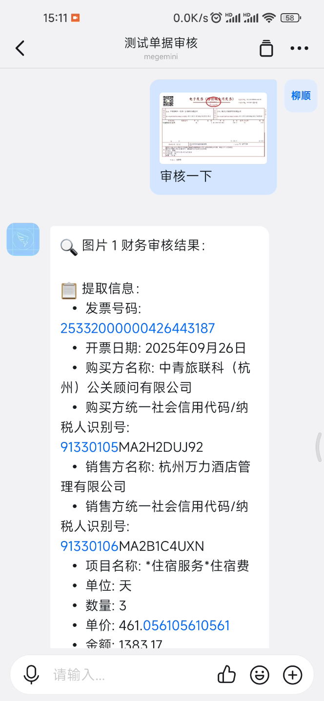
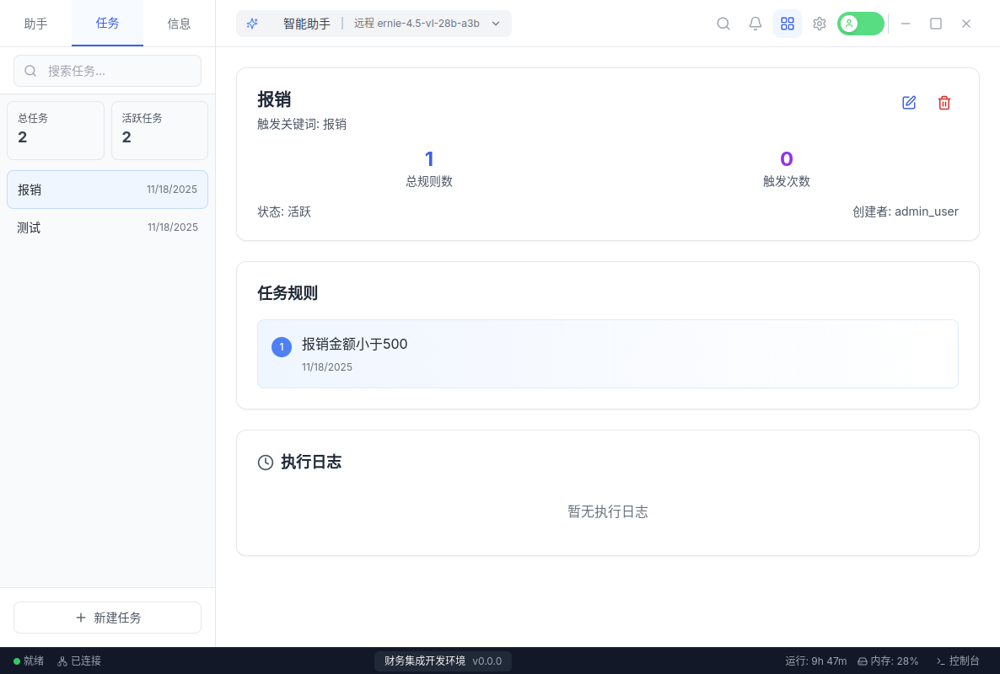
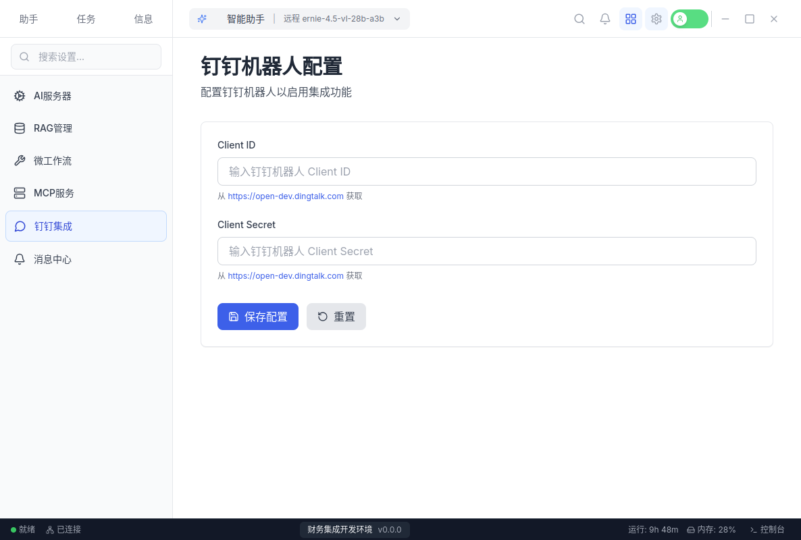

# 财务文档智能审核系统项目方案书

## 1. 项目概述

### 1.1 项目背景

某公司希望通过 AI 帮助财务进行单据审核。公司中使用钉钉作为 OA 系统，因此开发此原型进行技术验证，无需服务器即可打通 AI 单据审核系统与钉钉机器人。

### 1.2 项目范围

- **钉钉机器人接入与绑定**：实现AI审核系统与钉钉机器人的无缝集成
- **多模态财务文档识别与理解**：支持图片、PDF等多种格式
- **结构化信息提取与验证**：自动提取关键字段并进行合规性检查
- **智能规则匹配与审核**：基于公司规章制度进行逐条规则验证
- **审核报告生成与分析**：提供详细的审核结果和改进建议

## 2. 应用场景价值

### 2.1 目标场景

**核心应用场景：**

- **钉钉机器人智能审核**：员工可直接在钉钉中上传单据图片，机器人自动进行AI审核并返回结果
- **OA系统无缝集成**：与钉钉组织架构深度整合，实现企业级审核流程
- **大模型抽取审核规则**：从公司规章制度文档中自动提取审核规则，构建企业知识库
- **规则智能解析**：利用大模型解析公司规章制度并自动输出审核规则

**钉钉机器人审核价值：**

- **免服务器部署**：直接使用钉钉云服务，无需额外基础设施投入
- **成本效益显著**：仅需钉钉开发者账号，无服务器维护费用
- **移动办公支持**：员工可在手机钉钉中直接完成单据提交和审核查看

### 2.2 用户核心痛点

**当前痛点分析：**

- **人工审核效率低下**：财务人员需要逐张检查发票，处理大量重复性工作
- **审核标准不统一**：不同审核人员对规则理解存在差异，导致审核结果不一致
- **合规风险控制**：难以实时监控和预警潜在的合规风险

## 3. 技术架构与模型应用

### 3.1 架构设计

**基于LangChain的智能审核核心架构：**

```
┌─────────────────────────────────────────────────────────────┐
│                   多模态财务审核智能体                      │
├─────────────────────────────────────────────────────────────┤
│  ┌─────────────┐  ┌─────────────┐  ┌─────────────┐         │
│  │  文档预处理 │  │ 多模态识别  │  │ 智能审核引擎 │         │
│  │   模块      │  │   模块      │  │   模块      │         │
│  └─────────────┘  └─────────────┘  └─────────────┘         │
└─────────────────────────────────────────────────────────────┘
                               │
                               ▼
┌─────────────────────────────────────────────────────────────┐
│                   多模态大模型服务层                         │
├─────────────────────────────────────────────────────────────┤
│  ┌─────────────┐  ┌─────────────┐  ┌─────────────┐         │
│  │ 视觉理解模块 │  │ 文本理解模块 │  │ 多模态融合模块 │       │
│  └─────────────┘  └─────────────┘  └─────────────┘         │
└─────────────────────────────────────────────────────────────┘
                               │
                               ▼
┌─────────────────────────────────────────────────────────────┐
│                     LangChain核心层                          │
├─────────────────────────────────────────────────────────────┤
│  ┌─────────────┐  ┌─────────────┐  ┌─────────────┐         │
│  │ DingTalk集成│  │ 会话管理模块 │  │ 工具调用模块   │         │
└─────────────────────────────────────────────────────────────┘
                               │
                               ▼
┌─────────────────────────────────────────────────────────────┐
│                MCP服务器工具层                           │
├─────────────────────────────────────────────────────────────┤
│  │城市分级服务│  │发票识别服务│  │ 日期时间服务 │         │
└─────────────────────────────────────────────────────────────┘
```

### 3.2 核心技术创新

**LangChain框架优势：**

- **会话管理**：支持多用户并发，每个会话独立存储API配置和审核规则
- **历史上下文**：基于对话历史的智能分析
- **工具调用系统**：集成多个MCP服务器，提供专业功能
- **结构化输出**：直接返回JSON格式数据，便于系统集成

**钉钉机器人集成（无服务器部署优势）：**

- **零服务器成本**：基于钉钉开放平台，无需额外部署服务器
- **企业级安全**：通过钉钉企业认证，确保数据安全
- **移动办公支持**：员工可直接在钉钉中提交审核请求
- **实时消息推送**：审核结果即时推送到钉钉机器人
- **AI服务集成**：将已有的OpenAI配置直接应用于钉钉机器人

**多模态模型与传统OCR对比优势：**

- **准确性提升**：多模态联合分析减少单一模态的识别错误
- **上下文理解**：基于语义理解而非单纯字符匹配
- **异常检测**：能够识别涂改、遮盖等异常情况
- **格式适应性**：更好地处理各种文档格式和版式
- **结构化输出**：直接输出标准化的JSON格式数据，便于后续处理

## 4. 技术实现细节

### 4.1 多模态处理流程

1. **文档上传**：支持多种格式（图片、PDF、Word等）
2. **OCR预处理**：使用PaddleOCR进行文本提取
3. **AI智能分析**：基于LangChain框架进行语义理解和规则验证

### 4.2 钉钉集成机制

- **Webhook接收**：实时接收钉钉用户消息
- **AI服务配置**：复用现有OpenAI配置，无需额外API费用
- **规则自动解析**：从文档中智能提取审核规则
- **多工具协作**：可扩展、集成 MCP 专业工具

## 5. 总结与展望

本项目通过引入多模态大模型技术和LangChain架构，结合钉钉机器人免服务器部署方案，将显著提升财务文档智能审核的准确性和效率。

## 6. 附录

### 6.1 项目 DEMO 展示

本 DEMO 使用 Gradio 开发，共分 5 个步骤：

1. 设置：设置使用的模型，使用 openai 接口，可以绑定钉钉机器人
2. 知识库：上传文档，并通过大模型解析公司的规章制度为审核规则
3. MCP服务器管理：可以接入 MCP 服务器帮助进行审核
4. 智能体：进行文档审核
5. 手机端：通过手机钉钉进行审核

AI Studio 地址：https://aistudio.baidu.com/application/detail/103657

视频演示地址：https://www.bilibili.com/video/BV1ybUWBhEvh/?vd_source=52a02e4f0aa6b27776bd86a6d103f2d1

#### step1 设置


#### step2 知识库


#### step3 MCP服务器


#### step4 智能体


#### step5 手机端钉钉机器人




### 6.2 多模态大模型的优势

对于以下示例单据：


单独使用 OCR 方法识别文本内容：


使用 OCR + 语言大模型可以输出结构化信息：


但是，两者都会出现识别错误，例如：


实际应该是：


使用 OCR + 多模态大模型可以解决这个问题：


** 注意 **： 由于是演示，所以图片中的部分敏感信息已经被遮盖。

另外，多模态大模型可以识别票据图片中的异常行为，例如：


这里将遮盖的部分识别为 `无`，也可以直接拒绝审核等操作。

### 6.3 专用 IDE 开发环境（研发中）

相比 gradio 的 DEMO，功能更完善，并且可以分配多个任务供钉钉机器人使用。




